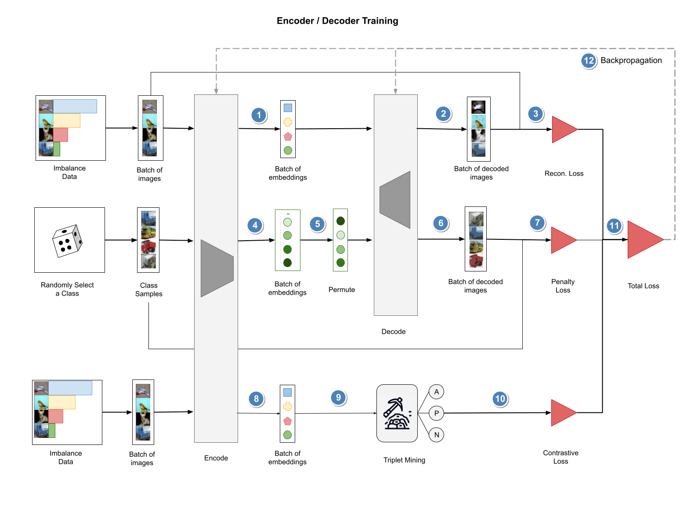

# Contrastive DeepSMOTE for Synthetic Data Generation
 - Contrastive DeepSMOTE is a Synthetic Data Generator which can be used in dealing with Imbalaced Dataset.
 - It is based on SMOTE algorighm where interpolation method is used to generate Synthetic samples.
 - It is also based on DeepSMOTE algorithm which is basically an AutoEncoder to encode any image into feature space and then decode it back into an image.
 - Contrastive learning is used to keep relative distance among samples from different categories in the feature space

# Algorithm Work Flow

Contrastive DeepSMOTE trainging phase

Contrastive DeepSMOTE inference phase

# Process Flow
 - Data Preprocessing
   - split to training, validation, test sets
   - Normalization
   - Introducing imbalance ratio
 - Training Contrastive DeepSMOTE, the synthetic data generator based on AutoEncoder and Contrastive DeepSMOTE
 - Generated SMOTEd Data
 - Use SMOTEd Data to train ResNet-18
 - Test Trained ResNet-18 on test set
